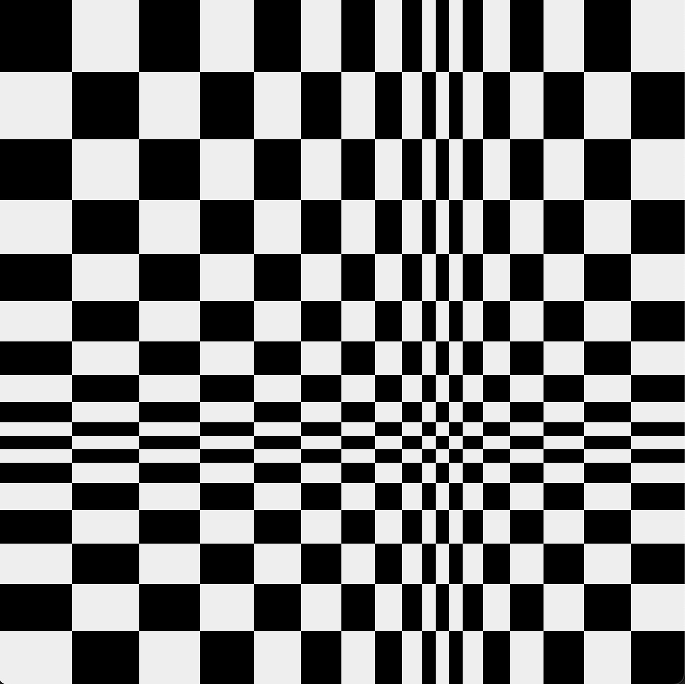

# PyxelArt

In groups of four, students will create a series of art pieces. Individually each student must take responsibility for at least one of the art pieces, although the group is expected to coordinate the series. The pieces must be produced with Python using the Pyxel package, although the students may print and augment their work physically before submitting a scan. Finally, the students must understand the proof of work procedure behind NFTs, and put this into practice to trade ownership of the final products.

In my part of the project, students will be using the fabulous [Pyxel](https://github.com/kitao/pyxel) module for Python to create their artwork.

```
import pyxel

edges = [0]
s = 0
w = 11
while s < 100:
    s = s + abs(w)
    edges.append(s)
    w = w - 1

pyxel.init(edges[-1], edges[-1])

for i in range(len(edges)):
    for j in range(len(edges)):
        pyxel.rect(edges[i], edges[j], 11, 11, ((i + j) % 2)*7)

pyxel.show()
```


